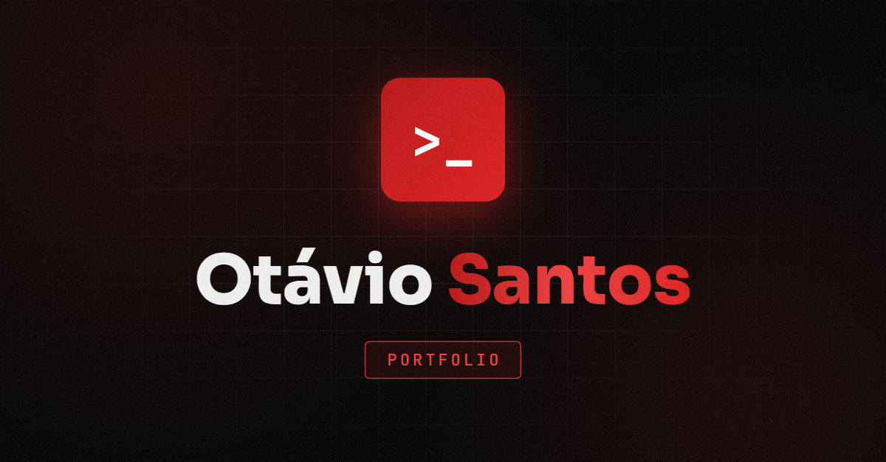

---

### `$ whoami`

Desenvolvedor **Fullstack Pleno** com 3 anos de experiência construindo interfaces, APIs escaláveis e produtos de **IA** com agentes autônomos em produção.

- 💼 **PedBot** (Grupo Funcional Health Tech) — de estagiário a pleno, desde nov/2023
- 🤖 Agentes de IA orquestrados com **LangGraph** e integrados à **API do WhatsApp**
- 🎓 Ciências da Computação · UNIVEM (2023 — 2026)
- 📍 Marília, SP — Brasil

### `$ cat stack.txt`

  

 

